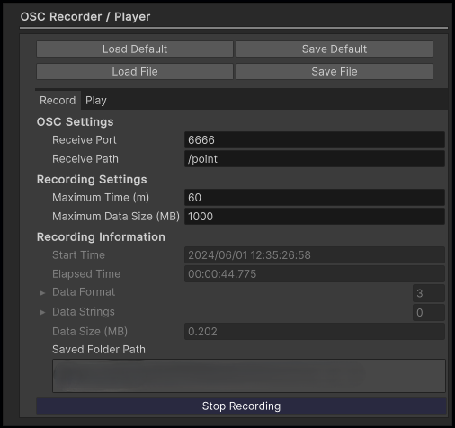
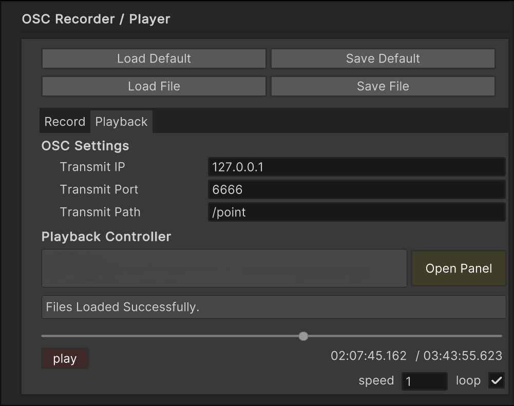

# OSC Recorder / Player for Windows

OSCで受け取ったデータの記録および記録したデータの再生（OSC送信）ができるアプリです  

* OSはWindowsのみ対応しています
* 常に同じフォーマットでOSCが送られてくることを想定しています
* Int, Float, String以外のデータフォーマットには対応していません
* Stringの種類がOSCのデータ数に対して十分少ないことを想定しています

## OSC Recorder



OSCで受け取ったデータの記録が可能です  

保存データがPCを圧迫しないように記録する最大時間(分)、最大サイズ(MB)を指定できます

`マイドキュメント/OscData/yyyymmdd_HHmmss`下にファイル群が格納されます

各ファイルの内容は以下の通りです
```text
data.bin:
  OSCを受け取った時間(8byte)および各データ要素(4byte)が保存されています
  ファイルサイズは(OSCデータの数)x(8+4xOSC内の要素数)Byteです

info.txt:
  レコードに関する情報が記述されています

string.txt:
  OSCで受け取ったstringを保存しています
  OSC Playerではこの情報をもとにバイナリデータをstringにデコードします

time.bin:
  一秒置きのOSCデータの数を保存しています
  OSC Playerでシークを行うときに使用します

type.txt:
  OSCのフォーマット情報を保存しています
  OSC Playerではこの情報をもとにバイナリデータを各要素値にデコードします
```

## OSC Player



OSC Recorderで記録したデータの再生（OSC送信）が可能です

指定したフォルダに適切なファイル群がそろっていれば再生が可能となります

シークバーを利用した時間の移動や速度の変更等ができます
